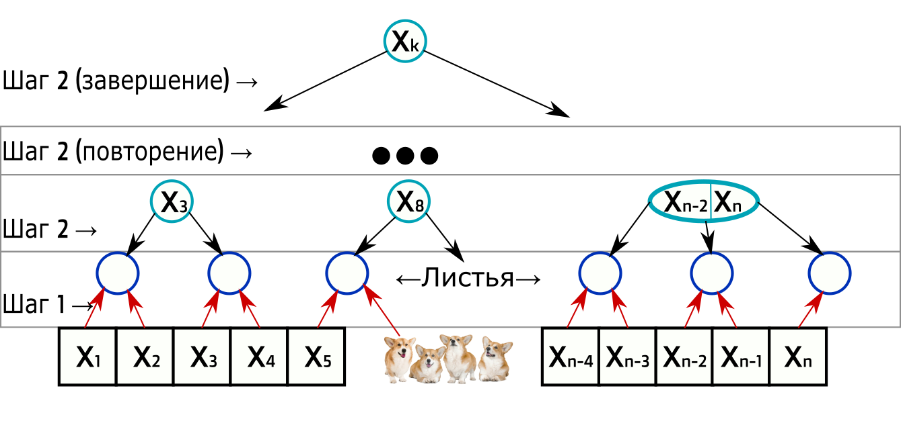

## HW 3

## Содержание

* Домашние работы
    * [**HW1**](./../HW1/README.md)
    * [**HW2**](./../HW2/README.md)
    * **HW3**
    * [**HW4**](./../HW4/README.md)
    * [**HW5**](./../HW5/README.md)
    * [**HW6**](./../HW6/README.md)
    * [**HW7**](./../HW7/README.md)
    * [**HW8**](./../HW8/README.md)
* Практические задания
    * [**CW1**](./../CW1/README.md)

## Task 1

Даны m отсортированных элементов. Удалите их из 2-3-дерева за O(m log n) work и O(log m (log n + log m)) span. (
Псевдокод не нужен, опишите просто идею)

#### Идея

Аналогично параллельному добавлению, будем удалять элементы каждый поток в своём поддереве удаляет часть элементов (
которые в массиве), если в вершинах остаётся один лист, то пробрасываем его вверх. При джойне восстанавливаем инвариант
дерева ребалансировкой (можно просто вставкой проброшенных вершин).

#### Более подробное описание алгоритма

Отдельно вырожденный случай, когда корень - лист (просто удаляем из него за O(1)).

1. Берём вершину, и текущий массив для удаления:
    1. Если поддеревья - листья, то удаляем все совпадающие значения вершин с элементами из массива.
        1. Осталось 3 или 2 листа, ОК - ничего не делаем;
        2. Осталась 1 лист - если в нём 2 значения, то ОК и сделаем из него 2 листа, иначе пробрасываем данный лист
           вверх;
        3. Осталось 0 листов - возвращаем инф-цию, что текущая вершина удалена;

        * return (оставшиеся пункты не выполняем).
    2. Рассмотрим поддеревья не листы (их 2 или 3):
        * Если в дереве могут быть эл-ты из массива, то берём часть массива для данного поддерева (т.к. массив отсорчен
            - ищем место делящего элемента из вершины в массиве (за log(m)) и передаём подмассив) и fork на выполнение
              шага 1;
        * Если в дереве не содержится эл-тов из массива, то пропускаем его;
        * join.
    3. Выполним ребалансировку, вставив в оставшееся дерево проброшенные вершины;
        * Может получиться, что на данном этапе текущая вершина должна разделиться на 2, но мы не будем делить.
    4. Выполним:
        1. Осталось >4 вершин - пробрасываем вверх, что бы осталось только 3;
        2. Осталось 3 вершины - ОК;
        3. Осталось 2 вершины - ОК;
        4. Осталась 1 вершина - пробрасываем вверх;
        5. Осталось 0 вершин - возвращаем что текущая вершина удалена;

#### Оценки

* Т.к. мы каждый раз делим отсорченый массив то мы сделаем не более log(m) форков
* На каждом этапе мы делаем ребалансировку, элементов для ребалансировки может быть не больше вершин чем мы удалили
    * span log(n);
    * work min(m, log(n))log(n);
* На каждом этапе делаем разбиение массива (span(log(m)))

Исходя из этого получаем, что:

* span: O(log(m)(log(n) + log(m)))
* work: O(mlog(n))

## Task 2

Постройте 2-3 дерево по отсортированному массиву из n элементов за O(n) work и O(log n) span.

#### Дано

Отсортированный массив из n элементов.

#### Идея

Будем строить дерево с нижнего слоя. Объединим соседние эл-ты массива в пары, если ко-во нечётное, то будет один элемент
без пары. Будем продолжать объединять в пары уже имеющиеся пары и так далее.

#### Алгоритм

1. Данн массив, объединим соседние элементы в вершины (если длина нечётная то будет вершина с одним элементном) данные
   вершины будут листами дерева.
2. Имеется m упорядоченных вершин, параллельно выполним их попарное объедение в вершины, если вершин нечётное кол-во, то
   последняя одна или две вершины будут содержать по 3 вершины. Будем повторять шаг 2, пока не останется 1 вершина -
   корень дерева.

Операция объединения двух вершин (левой и правой) в одну - новая вершина с элементом минимальным из правой вершины и
двумя поддеревьями - левой и правой вершиной

#### Оценки

1. Шаг 2 будет повторяться не более чем log(n) раз.
2. Операции в каждом слое выполняются параллельно.

Исходя из этого получаем, что:

* span: O(log(n))
* work: O(n)
