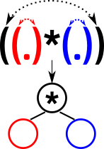

# HW 5

## Содержание

* Домашние работы
    * [**HW1**](./../HW1/README.md)
    * [**HW2**](./../HW2/README.md)
    * [**HW3**](./../HW3/README.md)
    * [**HW4**](./../HW4/README.md)
    * **HW5**
* Практические задания
    * [**CW1**](./../CW1/README.md)

## Task 1

Дана правильная скобочная последовательность. Нужно найти у каждой скобки соответствующую пару за O(n) work и O(\sqrt{n}
polylog n) span.

#### Идея

Баланс скобок + поразрядная сортировка.

#### Алгоритм

1. Назначим баланс скобки:
    1. Назначим +1 открывающей скобке, а -1 закрывающей;
    2. Найдём префикс (scan), найденные значения - соответствуют балансу скобки;
2. Открывающей скобке соответствует следующая закрывающая скобка с тем же балансом. Установим соответствие:
    1. Отсортируем скобки по балансу стабильной сортировкой;
    2. Теперь скобки расположены парами - открывающая и соответствующая ей закрывающая.

#### Оценки

1.
    1. pfor
    2. scan
2.
    1. radix sort
    2. pfor

Итого:

* work - O(n)
* span = span radix sort - O(sqrt(n) * polylog n)

## Task 2

Дано выражение, где каждая операция обрамлена скобками, а операнды - цифры. Постройте дерево вычислений за O(n) work и
O(\sqrt{n} polylog n) span.

#### Идея

Найдём всем скобкам пары (по предыдущей задаче) +  ~~пол это лава~~ скобки это вершины.

#### Алгоритм

1. Найдём всем скобкам пары (task 1);
2. Построим дерево вычислений, сделав соответствия:
    * Скобки - родительская вершина с операцией
    * Левый ребёнок - левая часть выражения
    * Правый ребёнок - правая часть выражения

#### Оценки

1. Возьмём результат task 1
2. Для каждой пары скобок создадим вершину (pfor)
3. Назначим детей (pfor)

Итого

* work = work task 1 - O(n)
* span = span task 1 - O(sqrt(n) * polylog n)