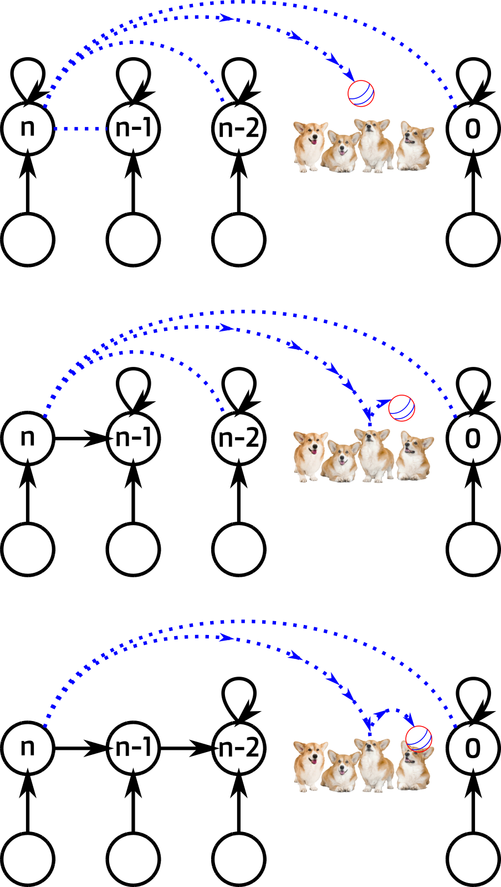

# HW 6

## Содержание

* Домашние работы
    * [**HW1**](./../HW1/README.md)
    * [**HW2**](./../HW2/README.md)
    * [**HW3**](./../HW3/README.md)
    * [**HW4**](./../HW4/README.md)
    * [**HW5**](./../HW5/README.md)
    * **HW6**
    * [**HW7**](./../HW7/README.md)
    * [**HW8**](./../HW8/README.md)
* Практические задания
    * [**CW1**](./../CW1/README.md)

## Task 1

Постройте пример графа, на котором алгоритм без прицепления звёзд (т.е., без второй стадии) будет работать за линейный
span.

#### Идея

Назначим индексы звёздам так, чтобы на каждой итерации выполнялось только 1 прицепление.

#### Граф

* Рёбра в изначальном графе - синие прерывистые линии.

###### Пояснение

На первом этапе, можно прицепить корень, только если его номер больше, чем номер корня того к кому цепляем.

На рисунке имеется только одина звезда с номером корня большем чем у других, значит прицепить можно только её. Тогда в
худшем случае, прицепим её к звезде с наибольшим индексом (что бы сохранить инвариант "имеется только одина звезда с
номером корня большем чем у других").