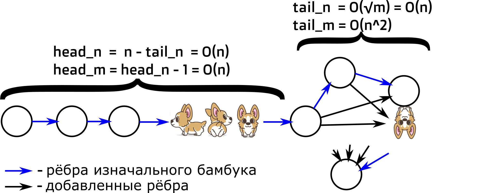

# HW 7

## Содержание

* Домашние работы
    * [**HW1**](./../HW1/README.md)
    * [**HW2**](./../HW2/README.md)
    * [**HW3**](./../HW3/README.md)
    * [**HW4**](./../HW4/README.md)
    * [**HW5**](./../HW5/README.md)
    * [**HW6**](./../HW6/README.md)
    * **HW7**
* Практические задания
    * [**CW1**](./../CW1/README.md)

## Task 1

Предъявите граф с ровно m = o(n^{2-eps}) рёбер (m, n и eps заданы заранее), на котором рандомизированный алгоритм поиска
компонент сильной связности работает за \Omega(m log n).

###### Пояснение

* Дано: n, m
    * n <= m-1 << n^2

#### Идея

Заметим, что на бамбуке будет требуемая сложность. Тогда будем наращивать бамбук до требуемого m, ориентированным
"полным" графом в хвосте.

#### Решение

Построим решение на док-ве [из лекции](https://youtu.be/2gnY7BCu4fo?list=PLrV7qfjOKniv6161oy4z2ff_a5ljAM7iI&t=651).

###### Рассмотрим бамбук (m = n):

Бамбук рассматривался на лекции (частный случай topsort).

###### Рассмотрим m+:

Распределим личние рёбра применяя данные правила:

* Добавляем ребро так, что бы не появилось компонент связности;
* Добавим ребро в конец (соединяя две возможные ещё не соединённые вершины в самом конце).

Тогда граф будет иметь такой вид:

* Между O(sqrt(m)) вершин в конце будет O(m^2) ориентированных рёбер;
* В начале будет бамбук длины O(n).

Заметим, что имеется ~~апендикс~~ бамбук длины head_n O(n), значит topsort даст тот же бамбук и док-во с лекции всё ещё
работает, ч.т.д.

###### Ограничение сверху (на наращивание):

При m = (n - n/logn)^2 ~= n^2/logn наращивание перестаёт работать т.к. head_n = (n - n + n/logn) = n/logn, что ломает
исходное док-во с лекции (т.к. log сократится).

